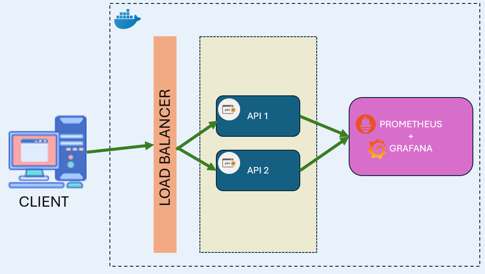
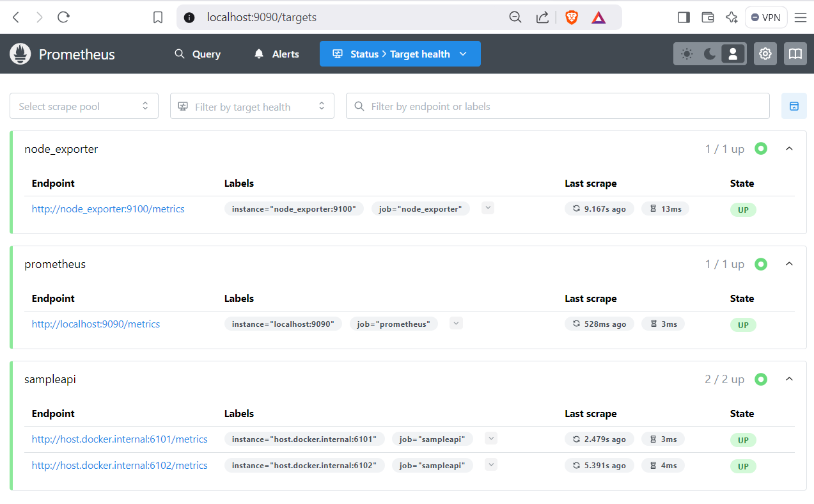
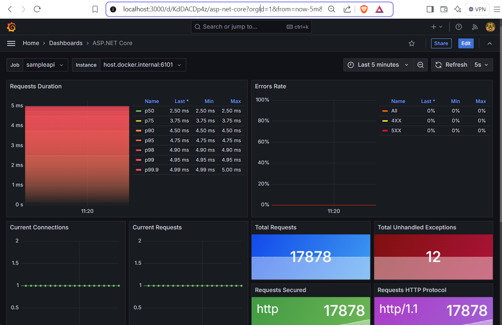

# Yüksek Trafikli Sistemlerde Fail-Over Mekanizması

Yüksek trafikli sistemlerde load balancer ile yük dağıtımı ve fail-over senaryolarını simüle etmek için hazırlanmıştır.

## Mimari


## Backend
Backend projesi ASP.Net Core Web API olarak oluştulmuş ve docker üzerinde 2 ayrı container olarak ayağa kaldırılmıştır.

Uygulamayı docker da çalışır hale getirmek için, kök klasör içinde bu komutları kullanınız.

``` powershell
$ docker compose -f .\docker-compose.yml up -d
$ docker compose -f .\docker-compose-new.yml up -d
```


Aşağıdaki adresler üzerinde api'ler ayağa kalkacaktır.

```
http://localhost:6101/weather/trabzon?days=2
http://localhost:6102/weather/trabzon?days=2
```
## Load-Balancer

Load-balance yapmak için iki ayrı load balancer kullanılmıştır.

### 1-nginx: 

nginx-config klasörü içinde aşağıdaki komut çalıştırılmalıdır

```
docker compose -f .\docker-compose.yml up -d
```

Aşağıdaki adresten load-balancer ile api'lara erişim sağlanmaktadır.

```
http://localhost:6100/weather/trabzon?days=2
```

### 2-HAProxy: 

haproxy-config klasörü içinde aşağıdaki komut çalıştırılmalıdır

```
docker compose -f .\docker-compose.yml up -d
```

Aşağıdaki adresten load-balancer ile api'lara erişim sağlanmaktadır.
```
http://localhost:8100/weather/trabzon?days=2
```

## Monitoring


prometheus-grafana-config klasörü içinde aşağıdaki komut çalıştırılmalıdır

```
docker compose -f .\docker-compose.yml up -d
```

### Prometheus
Aşağıdaki adresten prometheus uygulamasına erişim sağlanabilir.
```
http://localhost:9090
```
***Target health*** menüsünden tüm endpointlerin ***UP*** durumda olduğu kontrol edilmelidir.



### Grafana
Aşağıdaki adresten grafana uygulamasına erişim sağlanabilir.

Kullanıcı adı : admin \
Parola: grafana

```
http://localhost:3000
```
Datasources menüsününde baktığımız Prometheus 'un ekli olduğu kontrol edilmelidir.

Dashboard Import bölümünden ***19924*** ve ***19925*** numaralı dashboardlar eklenmelidir



## Testing

k6 uygulaması ile sanal trafik oluşturarak sistemimizi test edeceğiz. Test aşamasında docker üzerinden API' larımızın ayakta olduğu container'lar birini durdurup load-balancer ın tüm trafiği ayakta olan API'a yönlendirmesini bekleyeceğiz.


k6-config klasörü içinde aşağıdaki komut çalıştırılmalıdır.

nginx ile test etmek için aşağıdaki komut çalıştırılır
``` bash
$ k6 run api.js
```

nginx ile test etmek için aşağıdaki komut çalıştırılır
``` bash
$ k6 run api-nginx.js
```

HAProxy ile test etmek için aşağıdaki komut çalıştırılır
``` bash
$ k6 run api-haproxy.js
```

Test uygulamasıda; 500 sanal kullanıcı oluşturup 3 dakika boyunca istek gönderme senaryosu için, script dosyasını aşağıdaki gibi düzenledim.

``` javascript
export const options = {
    vus: 500,
    duration: '3m',
}
```

Kalın Sağlıcakla...